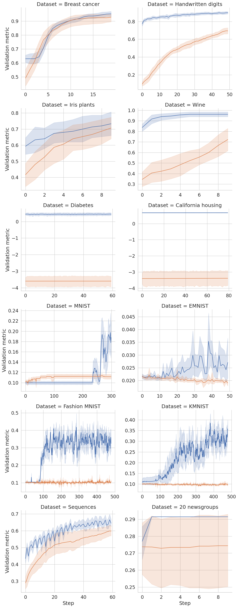

# Data driven initialization for neural network models

This repository contains the reference implementation of the IDEAL method to initialize the parameters of a neural network, using the training data to find adequate initial values for the model's weights and biases.

## Repository structure

The initialization methods are implemented in `ideal_init/initialization.py` and can be used with PyTorch models. An example of how to use them with PyTorch Lightning modules can be found in `ideal_init/lightning_model.py`. These modules are used in all the examples in the remaining folders: `tabular_classification`, `tabular_regression`, `image_classification` and `sequence_classification`. These examples are Jupyter notebooks that can be directly run if PyTorch, scikit-learn and PyTorch Lightning are already installed.

## Method performance

Although each notebook in the examples can be run independently from the others, we chose to visualize all the results in a single figure, using the minimalistic code in `plot_training.ipynb`. The results are presented in the following image, where IDEAL is shown in blue, the Kaiming He method in orange, the solid lines represent the mean of 10 similar experiments, and the shadows around the lines represent a 95% confidence interval.

